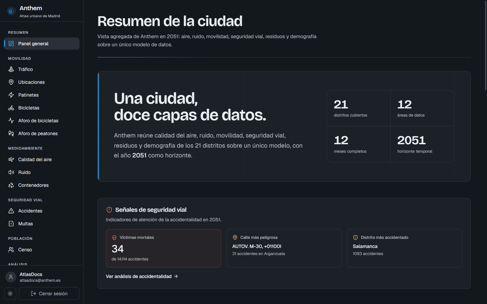
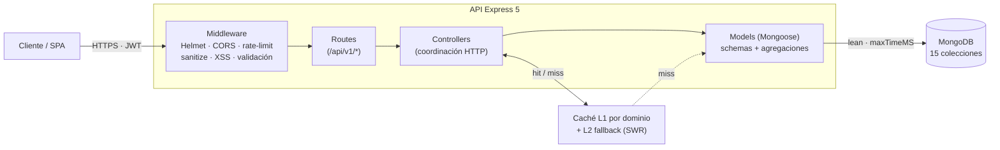
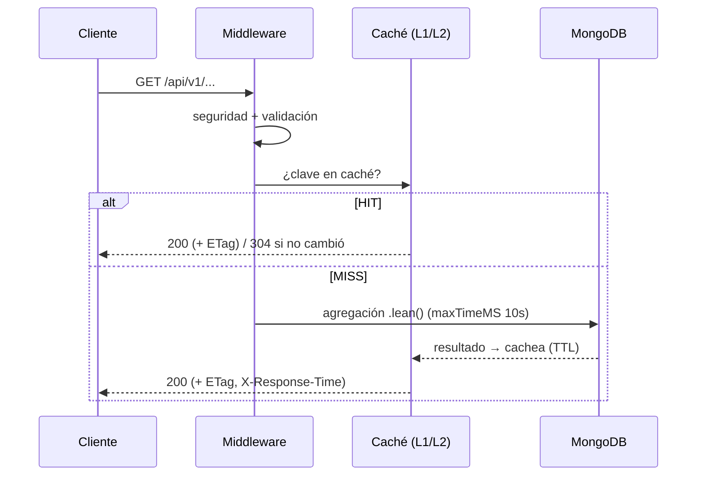
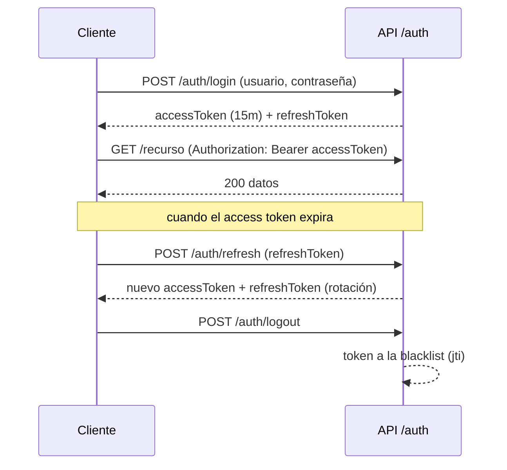

<div align="center">

# API-Anthem · Smart City 2051

**API REST para el atlas de datos urbanos de Anthem (Madrid simulado, año 2051).**
Node.js + Express 5 + MongoDB, con autenticación JWT, seguridad reforzada y un modelo
preparado para gestionar **cientos de millones de documentos**.


</div>

---

## Tabla de contenidos

- [Descripción general](#descripción-general)
- [Características clave](#características-clave)
- [Arquitectura](#arquitectura)
- [Stack tecnológico](#stack-tecnológico)
- [Requisitos previos](#requisitos-previos)
- [Instalación y puesta en marcha](#instalación-y-puesta-en-marcha)
- [Variables de entorno](#variables-de-entorno)
- [El dataset original](#el-dataset-original)
- [Importación de datos (dos modos)](#importación-de-datos-dos-modos)
- [Colecciones y volúmenes](#colecciones-y-volúmenes)
- [Semántica de datos no obvia](#semántica-de-datos-no-obvia)
- [La API](#la-api)
- [Ingesta IoT](#ingesta-iot)
- [Seguridad](#seguridad)
- [Rendimiento y caché](#rendimiento-y-caché)
- [Scripts npm](#scripts-npm)
- [Logs](#logs)
- [Despliegue en producción](#despliegue-en-producción)
- [Limitaciones conocidas](#limitaciones-conocidas)
- [Estructura del proyecto](#estructura-del-proyecto)
- [Documentación complementaria](#documentación-complementaria)

---

## Descripción general

**Anthem** es una Smart City ficticia (Madrid en el año **2051**). Esta API expone, a través de
una interfaz REST coherente, los datos abiertos simulados de la ciudad: calidad del aire, ruido,
tráfico, accidentalidad, multas, censo demográfico, residuos, movilidad blanda (bicicletas y
patinetes) y aforos de peatones y ciclistas en los **21 distritos**.

El reto técnico del proyecto no es la cantidad de endpoints, sino el **volumen de datos**: la
colección de tráfico sola contiene **~132 millones** de mediciones. La API está diseñada para
responder en milisegundos sobre ese volumen mediante agregados pre-calculados, índices
compuestos, caché multi-nivel y consultas optimizadas.

Esta API es el backend que alimenta el dashboard [**Frontend-Anthem**](https://github.com/Samuel-Prog-CSec/Frontend-Anthem):



---

## Características clave

- **Autenticación JWT** con *access* + *refresh tokens*, rotación de refresh, `jti` por token y
  *blacklist* persistente para revocación individual (logout).
- **Seguridad por capas**: Helmet, rate limiting diferenciado, sanitización NoSQL, protección
  XSS, validación de entrada (`express-validator`) y CORS configurable por origen.
- **Preparada para millones de documentos**:
  - Rollup diario pre-agregado `traffic_daily` (~132M → ~1,45M) del que leen los endpoints.
  - Índices compuestos ESR (Equality-Sort-Range) para los patrones de consulta frecuentes.
  - Importación **por fases** con gestión de índices (drop + recreate) en las colecciones pesadas.
- **Rendimiento**: caché en memoria especializada por dominio + nivel L2 de *fallback*
  (*stale-while-revalidate*), `.lean()` en el 100 % de las lecturas, `Promise.all` para
  consultas independientes, compresión GZIP y ETags (respuestas `304 Not Modified` reales).
- **Observabilidad**: logging estructurado JSON con Pino y cabecera `X-Response-Time` con
  avisos automáticos de operaciones lentas.
- **Ingesta IoT**: endpoints `POST` autenticados (rol `sensor`) para alimentar la ciudad en
  tiempo real desde el [simulador IoT](https://github.com/Samuel-Prog-CSec/Simulador-IoT-Anthem).

---

## Arquitectura

Arquitectura **MVC** con separación estricta: los controladores solo coordinan HTTP y la lógica
de negocio (agregaciones) vive en métodos estáticos de los modelos.



**Ciclo de vida de una petición de lectura:**



---

## Stack tecnológico

| Capa | Tecnología | Versión |
| --- | --- | --- |
| Runtime | Node.js | ≥ 22.19.0 |
| Framework | Express.js | 5.2 |
| Base de datos | MongoDB + Mongoose ODM | Mongoose 9.0 |
| Autenticación | jsonwebtoken + bcryptjs | 9.0 / 3.0 |
| Seguridad | helmet · express-rate-limit · express-mongo-sanitize · xss · express-validator | — |
| Caché | node-cache (multi-instancia + L2) | 5.1 |
| Logging | Pino + pino-http + pino-pretty | 10 / 11 / 13 |
| Compresión | compression (GZIP nivel 6) | 1.8 |
| Geo | proj4 (UTM ETRS89 → WGS84) | 2.20 |
| Calidad | ESLint 9 | 9.39 |

---

## Requisitos previos

- **Node.js ≥ 22.19.0** y npm.
- **MongoDB** accesible. Para la importación completa se recomienda **MongoDB local**
  (ver más abajo el porqué).
- **~8 GB libres** de disco si se va a importar el dataset original completo, más el espacio
  que ocupará la base de datos.

> En Windows, usa siempre `127.0.0.1` en `DATABASE_URI` (nunca `localhost`): con MongoDB nativo
> y/o Docker presentes, `localhost` puede resolverse a IPv6 (`::1`) o al contenedor y la app vería
> la base de datos vacía. Detalle en `.env.example`.

---

## Instalación y puesta en marcha

```bash
# 1. Instalar dependencias
npm install

# 2. Configurar el entorno (copia y edita)
cp .env.example .env
#   - genera JWT_SECRET y JWT_REFRESH_SECRET (distintos, >=32 chars):
#     node -e "console.log(require('crypto').randomBytes(64).toString('hex'))"

# 3. Arrancar
npm run dev      # desarrollo (nodemon, hot-reload)
npm start        # producción
```

- Servidor en `http://localhost:3000`, API bajo el prefijo **`/api/v1`**.
- Comprobación rápida: `GET http://localhost:3000/api/v1` (estado de la API).
- El arranque tarda unos segundos en precalentar las cachés (ubicaciones, distritos, stats).

---

## Variables de entorno

Plantilla completa en [`.env.example`](.env.example). Las imprescindibles están marcadas.

| Variable | Req. | Por defecto | Descripción |
| --- | :---: | --- | --- |
| `DATABASE_URI` | ✅ | `mongodb://127.0.0.1:27017/Anthem` | Cadena de conexión MongoDB (usa `127.0.0.1`). |
| `JWT_SECRET` | ✅ | — | Secreto de *access tokens* (≥32 chars, distinto al de refresh). |
| `JWT_REFRESH_SECRET` | ✅ | — | Secreto de *refresh tokens* (≥32 chars). |
| `NODE_ENV` | | `development` | `development` \| `production`. |
| `PORT` / `HOST` | | `3000` / `localhost` | Puerto y host del servidor. |
| `JWT_EXPIRE` / `JWT_REFRESH_EXPIRE` | | `15m` / `15d` | Caducidad de los tokens. |
| `BCRYPT_SALT_ROUNDS` | | `12` | Coste de hashing de contraseñas. |
| `RATE_LIMIT_WINDOW_MS` / `RATE_LIMIT_MAX_REQUESTS` | | `900000` / `100` | Ventana y tope del rate-limit general. |
| `TRUSTED_PROXIES` | | (loopback) | IPs/CIDR de proxies de confianza. **Imprescindible en producción** detrás de balanceador. |
| `CORS_ORIGINS` | | `localhost:3000,3001` | Orígenes permitidos (CSV). |
| `LOG_LEVEL` | | `debug` | `trace`…`fatal`. |
| `DB_MAX_POOL_SIZE` / `DB_TIMEOUT` | | `15` / `5000` | Pool y timeout de conexión. |
| `TEST_MODE` | | `false` | Modo prueba (bypass admin). **Solo se honra con `NODE_ENV=development`; aborta si es `true` en producción.** |

> El arranque **valida** estas variables: rechaza secretos placeholder o cortos en producción,
> y aborta si `TEST_MODE=true` con `NODE_ENV=production`.

### ¿Dónde están los datos? (MongoDB local vs. nube)

La variable que decide **a qué base de datos se conecta la API** es `DATABASE_URI`. **Debes
definirla** según dónde tengas los datos:

```bash
# A) MongoDB LOCAL — recomendado para la importación completa (~8 GB)
DATABASE_URI=mongodb://127.0.0.1:27017/Anthem

# B) MongoDB Atlas (nube) — usa el subset (--atlas) para caber en el free tier M0 (512 MB)
DATABASE_URI=mongodb+srv://<usuario>:<clave>@<cluster>.mongodb.net/Anthem?retryWrites=true&w=majority
```

La importación (`npm run import:data` / `--atlas`) usa **esta misma** `DATABASE_URI`: pobla la base
de datos a la que apunta. Para una demo en Atlas: pon la cadena de Atlas y ejecuta
`node scripts/importAll.js --atlas`. Para trabajar con todo el dataset, apunta a Mongo local y
ejecuta `npm run import:data`.

---

## El dataset original

Los datos crudos viven en el directorio **`datos_hpe/`** (63 CSV + 6 GPX, **~8 GB**, ~138 millones
de filas). No se versionan en el repositorio por su tamaño: hay que **descargarlos aparte**.

### Descarga e instalación de los datos

1. Descarga el ZIP del dataset oficial de la asignatura:

   **➡ [Descargar `datos_hpe.zip`](https://pruebasaluuclm-my.sharepoint.com/personal/ivan_gdiaz_uclm_es/_layouts/15/onedrive.aspx?id=%2Fpersonal%2Fivan%5Fgdiaz%5Fuclm%5Fes%2FDocuments%2FDATASET%5FSMART%5FCITY%5FSSIIUU%2Fdatos%5Fhpe%2Ezip&parent=%2Fpersonal%2Fivan%5Fgdiaz%5Fuclm%5Fes%2FDocuments%2FDATASET%5FSMART%5FCITY%5FSSIIUU&ga=1)**

2. **Descomprímelo dentro de la raíz de este repositorio (`API-Anthem/`)**, de modo que quede
   la carpeta `API-Anthem/datos_hpe/` con los CSV/GPX dentro. Los scripts de importación buscan
   los datos exactamente en esa ruta.

```text
API-Anthem/
└── datos_hpe/              <-- aquí va el contenido del ZIP
    ├── Aire/               (12 CSV mensuales)
    ├── Censo/              (12 CSV mensuales)
    ├── Multas/             (12 CSV mensuales)
    ├── Trafico/            (12 CSV mensuales, ~7,2 GB)
    ├── Ubicaciones/        (CSV + 6 GPX de transporte)
    └── Anthem_CTC_*.csv    (accidentes, contenedores, bicicletas, aforos...)
```

> No todos los CSV del ZIP se importan: algunos quedan fuera del modelo a propósito (callejero,
> instalaciones fotovoltaicas de 2049, taxi, estacionamiento regulado…). El detalle, en
> [`docs/dataset_information.md`](docs/dataset_information.md).

---

## Importación de datos (dos modos)

Toda la importación pasa por un único script maestro, [`scripts/importAll.js`](scripts/importAll.js),
que orquesta 12 importadores en **3 fases** (referencia → ligeros en paralelo → pesados en serie).
Para el detalle fino de cada flag y fase, consulta [`scripts/README.md`](scripts/README.md).

### Modo 1 — Importación completa (recomendado: MongoDB local)

```bash
npm run import:data
# equivale a:  node scripts/importAll.js
```

Importa **todos** los CSV completos. Pensado para el volumen real del proyecto (millones de
documentos por colección; solo tráfico son ~132M filas).

> ⚠️ **Importante**
> - Por el tamaño (la base de datos resultante ronda los **~8 GB**) se recomienda **MongoDB
>   local**, no Atlas free tier.
> - La importación completa tarda típicamente **entre 3 y 4 horas** según hardware. En equipos
>   modestos (poca RAM/CPU o disco lento) **puede ser bastante más**: el importador de tráfico
>   tiene por ello un *timeout* de hasta 6 horas.
> - Al terminar el tráfico, el script reconstruye automáticamente el rollup `traffic_daily`.

### Modo 2 — Subset para MongoDB Atlas (free tier M0, 512 MB)

```bash
node scripts/importAll.js --atlas
```

Importa un **subconjunto estratificado** de cada colección, calibrado para caber en el límite
**lógico de 512 MB** del free tier **M0** de Atlas (~455 MB de `dataSize + indexSize`), sin perder
variedad (todos los distritos, los 12 meses representados, pirámides con forma, etc.). Es rápido e
ideal para **demos y despliegues**. El plan por colección es editable en un solo sitio
([`scripts/importation/helpers/atlasPlan.js`](scripts/importation/helpers/atlasPlan.js)).

### Flags principales

| Flag | Efecto |
| --- | --- |
| `--atlas` | Subset reducido para Atlas M0 (512 MB) + reconstruye `traffic_daily`. |
| `--force` | Sobrescribe datos existentes (modo *upsert*). |
| `--only=x,y,z` | Importa solo ciertos dominios (p. ej. `--only=ubicaciones,aire,ruido`). |
| `--rebuild-indices=trafico[,censo,multas]` | *Recovery*: solo recrea índices (tras un crash). |
| `--skip-indices-management` | No dropea/recrea índices en la Fase 3 (comportamiento legacy). |
| `--help` | Ayuda completa. |

> **Tras cualquier reimportación de tráfico** hay que reconstruir el rollup diario
> (`node scripts/buildTrafficDaily.js`). `import:data` y `--atlas` ya lo hacen automáticamente.

---

## Colecciones y volúmenes

15 colecciones en la base de datos `Anthem` (13 de dominio + 2 de autenticación). Cifras
**orientativas** medidas sobre una importación local completa:

| Colección | ~Documentos | Qué representa |
| --- | ---: | --- |
| `traffic_measurements` | ~132 M | Medición de tráfico por punto cada ~15 min (intensidad, ocupación, carga, velocidad M30). |
| `traffic_daily` | ~1,45 M | **Rollup diario pre-agregado** del que leen los endpoints de tráfico. |
| `censuses` | ~2,85 M | Censo demográfico **mensual** por sección (edad, sexo, nacionalidad). |
| `fines` | ~1,99 M | Multas de tráfico (importe, calificación, tipo de infracción, ubicación). |
| `bike_traffic_counts` | ~304 K | Aforo horario de bicicletas por estación. |
| `pedestrian_traffic_counts` | ~177 K | Aforo horario de peatones por estación. |
| `air_quality` | ~56 K | Mediciones horarias de contaminantes (NO2, PM, O3, SO2…). |
| `containers` | ~38 K | Contenedores de residuos geolocalizados por tipo. |
| `accidents` | ~32 K | Accidentalidad vial **por afectado** (~14 K expedientes). |
| `locations` | ~27 K | Puntos de medición (tráfico/aire/ruido) y paradas de transporte. |
| `noise_monitoring` | ~550 | Niveles de ruido por estación y periodo del día (D/E/N). |
| `bike_availability` | ~365 | Disponibilidad y uso de bicicletas (1 registro por día). |
| `scooter_assignments` | ~128 | Reparto de patinetes por distrito y proveedor. |
| `users` | — | Usuarios autenticados (roles `admin`, `sensor`, `user`). |
| `token_blacklist` | — | Tokens revocados (logout). |

> 📌 **Aviso sobre las cifras**: estos números no tienen por qué coincidir al 100 % con tu base de
> datos. Durante el desarrollo se ha experimentado con el [simulador IoT](https://github.com/Samuel-Prog-CSec/Simulador-IoT-Anthem), que
> **inyecta datos adicionales** vía los endpoints de ingesta; por eso algunas colecciones (ruido,
> aforos, calidad del aire…) pueden tener **más documentos** de los que trae el dataset CSV original.

---

## Semántica de datos no obvia

Reglas críticas para una analítica correcta (detalle en [`docs/dataset_information.md`](docs/dataset_information.md)):

- **El censo es mensual**: son 12 fotos de la misma población. **Nunca sumes los 12 meses** (inflaría
  la población ×12). Para población por distrito, usa un único mes.
- **Accidentes por afectado**: cada fila es una persona implicada; varias comparten
  `numeroExpediente`. Para contar accidentes hay que agrupar por expediente **antes**.
- **Tráfico vía rollup**: las estadísticas leen de `traffic_daily`, no de los 132 M crudos. Solo los
  puntos **M30** miden velocidad (los **URB** no): la velocidad media se promedia solo sobre M30.
- **Nombres de distrito con/sin tilde** entre colecciones: los filtros del backend son
  acento-insensibles; las agregaciones que crucen por nombre normalizan diacríticos.
- **2051 no es bisiesto**: el dataset trae filas con fecha `2051-02-29` (inexistente). El importador
  las **rechaza** explícitamente.

---

## La API

Todos los endpoints cuelgan de **`/api/v1`**. Referencia completa (parámetros, ejemplos de
respuesta) en [`docs/API_Documentation.md`](docs/API_Documentation.md) y
[`docs/api-reference.md`](docs/api-reference.md).

| Recurso | Base | Propósito |
| --- | --- | --- |
| Auth | `/auth` | Registro, login, refresh, logout, perfil, cambio de contraseña. |
| Admin | `/admin` | Estadísticas de caché, salud del sistema, rendimiento, ETags (rol `admin`). |
| Ubicaciones | `/ubicaciones` | Estaciones, puntos de medición y transporte. `GET /mapa` (GeoJSON). |
| Calidad del aire | `/calidad-aire` | Contaminantes, estadísticas y tendencias. |
| Ruido | `/ruido` | Niveles por periodo, ranking, cumplimiento normativo, `GET /mapa`. |
| Accidentes | `/accidentes` | Listado, por expediente, estadísticas, mapa de calor, `GET /mapa`. |
| Multas | `/multas` | Listado, estadísticas, ranking de ubicaciones, análisis temporal, `GET /mapa`. |
| Censo | `/censo` | Datos censales, pirámide poblacional, análisis demográfico, dashboard. |
| Tráfico | `/trafico` | Mediciones (rollup), estadísticas, congestión, histórico, `GET /mapa`. |
| Patinetes | `/patinetes` | Asignaciones, estadísticas por distrito, `GET /mapa`. |
| Bicicletas | `/bicicletas` | Disponibilidad, tendencias, comparativa de suscripciones. |
| Aforo bicicletas | `/aforo-bicicletas` | Conteos, distribución horaria, por estación, `GET /mapa`. |
| Aforo peatones | `/aforo-peatones` | Conteos, distribución horaria, por estación, `GET /mapa`. |
| Contenedores | `/contenedores` | Listado, cercanos, estadísticas, cobertura, `GET /mapa` (por viewport). |

### Formato de respuesta

```jsonc
{
  "success": true,
  "message": "Operación exitosa",
  "data": { /* ... */ },
  "pagination": {            // en listados paginados
    "currentPage": 1,
    "totalPages": 42,
    "totalDocuments": 1024,
    "hasNextPage": true
  }
}
```

### Flujo de autenticación



---

## Ingesta IoT

Además de servir datos, la API **acepta datos en tiempo real** de sensores. Cada dominio
sensorizable expone `POST .../ingesta` (un dato) y `.../ingesta/lote` (lote), protegidos y con
validación estricta (rechazo `4xx` ante datos inválidos):

`/calidad-aire/ingesta` · `/trafico/ingesta` · `/ruido/ingesta` ·
`/aforo-bicicletas/ingesta` · `/aforo-peatones/ingesta` · `/ubicaciones/ingesta`

Estos endpoints exigen **rol `sensor`** (o `admin`). El registro público crea usuarios `user`
(solo lectura). Para crear una cuenta de sensor:

```bash
node scripts/provisionarSensor.js --username=<u> --email=<e> --password=<p>
```

La herramienta que los explota es el **[simulador IoT](https://github.com/Samuel-Prog-CSec/Simulador-IoT-Anthem)** (CLI sin dependencias
que autentica como sensor y alimenta la ciudad en modo *live* o *backfill* histórico).

---

## Seguridad

- **JWT** con access + refresh, rotación, `jti` y blacklist persistente.
- **Rate limiting** diferenciado: general (por IP), `/auth` (estricto, cuenta solo fallos),
  consultas pesadas, e ingesta (por usuario, no por IP).
- **Sanitización NoSQL** (`express-mongo-sanitize`) y **anti-XSS** (`xss`) sobre body/query/params.
- **Helmet** (CSP, HSTS solo en producción, COOP/CORP, referrer-policy) y **CORS** por origen.
- **Contraseñas** con bcrypt (12 salt rounds), política de complejidad y lockout por intentos.

Modelo de amenazas y decisiones en [`docs/threat-model.md`](docs/threat-model.md) y la carpeta
[`docs/Security/`](docs/Security).

---

## Rendimiento y caché

- **Caché L1** por dominio (TTL largo: el dataset 2051 es estático entre reimportaciones) +
  **L2 de fallback** (*stale-while-revalidate*): si la BD falla, sirve la última copia válida.
- **Cache warming** al arrancar (ubicaciones, distritos, stats) e **invalidación selectiva** en
  escrituras (ingesta).
- **ETags** SHA-256 sobre el contenido estable → respuestas **`304 Not Modified`** reales.
- `.lean()` en lecturas, `Promise.all` en consultas independientes, `$limit` antes de `$group`,
  `.maxTimeMS(10000)` en todas las queries y **compresión GZIP**.

Detalle en [`docs/Optimization_Documentation.md`](docs/Optimization_Documentation.md).

---

## Scripts npm

| Comando | Acción |
| --- | --- |
| `npm run dev` | Arranque con nodemon (hot-reload). |
| `npm start` | Arranque en producción. |
| `npm run import:data` | Importación masiva de datos (ver [Importación](#importación-de-datos-dos-modos)). |
| `npm run lint` / `lint:fix` | Linting ESLint (y autofix). |
| `npm run security:check-&-fix` | `npm audit` + `npm audit fix`. |
| `npm run profile:doctor` / `:flame` / `:heap` | Perfilado con Clinic.js. |

---

## Logs

En producción Pino escribe a `logs/server/*.log` (JSON, UTF-8). En Windows, para verlos sin
caracteres rotos:

```powershell
.\scripts\view-logs.ps1            # logs del servidor
.\scripts\view-logs.ps1 -Follow    # en tiempo real
.\scripts\view-logs.ps1 -LogFile errors
```

Más detalle en [`docs/Logging_System.md`](docs/Logging_System.md).

---

## Despliegue en producción

Objetivo de despliegue: **API en Render + base de datos en MongoDB Atlas**. Checklist al pasar a
`NODE_ENV=production`:

- `NODE_ENV=production`, `TEST_MODE=false`.
- `JWT_SECRET` y `JWT_REFRESH_SECRET`: aleatorios, distintos, ≥32 caracteres (el arranque rechaza
  placeholders y secretos cortos).
- `DATABASE_URI`: cadena de Atlas (usuario/clave + `retryWrites`). Para caber en el free tier,
  importa con `--atlas`.
- `CORS_ORIGINS`: origen(es) del frontend desplegado.
- `DB_MAX_POOL_SIZE`: 5. El .env tiene 15, Atlas M0 tiene recursos limitados.
- `TEST_MODE`: false.
- `HOST`:0.0.0.0 Sin esto el servidor escucha solo en loopback y Render no puede enrutarle tráfico.
- `TRUSTED_PROXIES`: **imprescindible en Render** Valor sugerido=1. Le dice a Express que confíe en 1 salto de proxy (el de Render), para que el rate limiting use la IP real del cliente.
- `autoIndex` está **off** en producción: crea los índices manualmente o en el primer arranque.
- Tras cualquier reimportación de tráfico, reconstruye `traffic_daily`.

---

## Limitaciones conocidas

### Ejecución sobre HTTP (sin TLS)

El proyecto corre sobre HTTP plano. **Es seguro para desarrollo local y entorno universitario**,
pero **no debe desplegarse a producción pública** sin terminar TLS en un proxy inverso (nginx,
traefik, Cloudflare, AWS ALB), forzar redirect HTTP→HTTPS y reactivar HSTS en
`src/middleware/security.js`. Detalle en [`docs/threat-model.md`](docs/threat-model.md)

### Sin MFA

Autenticación por usuario + contraseña (MFA diferido). Defensas activas: bcrypt 12 rounds,
rate-limit estricto en `/auth`, lockout por intentos, blacklist de tokens, rotación de refresh y
`passwordChangedAt` que invalida tokens previos.

### Acceso abierto al dataset entre usuarios autenticados

Por diseño, cualquier usuario autenticado puede leer cualquier registro. **No es una
vulnerabilidad**: los datos son sintéticos, sin PII real (ciudad ficticia de 2051).

---

## Estructura del proyecto

```text
API-Anthem/
├── src/
│   ├── config/         # config + validación env, BD, logger, cache warming, CORS
│   ├── constants/      # constantes y enums (core, auth, geo, dominios/...)
│   ├── controllers/    # coordinación HTTP (uno por dominio)
│   ├── middleware/      # seguridad, validación, caché, ETags, performance
│   ├── models/         # schemas Mongoose + estáticos de agregación (+ schemas/)
│   ├── routes/         # definición de endpoints con validación
│   └── utils/          # queryHelper, paginación, caché, responseHelper, errores
├── scripts/            # importadores y tareas (ver scripts/README.md)
│   ├── importAll.js
│   ├── buildTrafficDaily.js
│   ├── provisionarSensor.js
│   └── importation/    # 12 importadores + helpers/ (atlasPlan, índices, coords...)
├── docs/               # API, seguridad, optimización, dataset, logging
└── datos_hpe/          # dataset crudo (se descarga aparte, ver arriba)
```

---

## Documentación complementaria

- [`docs/API_Documentation.md`](docs/API_Documentation.md) — referencia completa de endpoints.
- [`docs/dataset_information.md`](docs/dataset_information.md) — semántica de campos del dataset.
- [`docs/Optimization_Documentation.md`](docs/Optimization_Documentation.md) — optimizaciones.
- [`docs/threat-model.md`](docs/threat-model.md) — modelo de amenazas y seguridad.
- [`scripts/README.md`](scripts/README.md) — guía detallada de importación.
- [Simulador-IoT-Anthem](https://github.com/Samuel-Prog-CSec/Simulador-IoT-Anthem) — simulador de nodos IoT.

---

<div align="center">

Proyecto universitario · Smart City **Anthem 2051** · Autor: **Samuel Blanchart Pérez**

</div>
