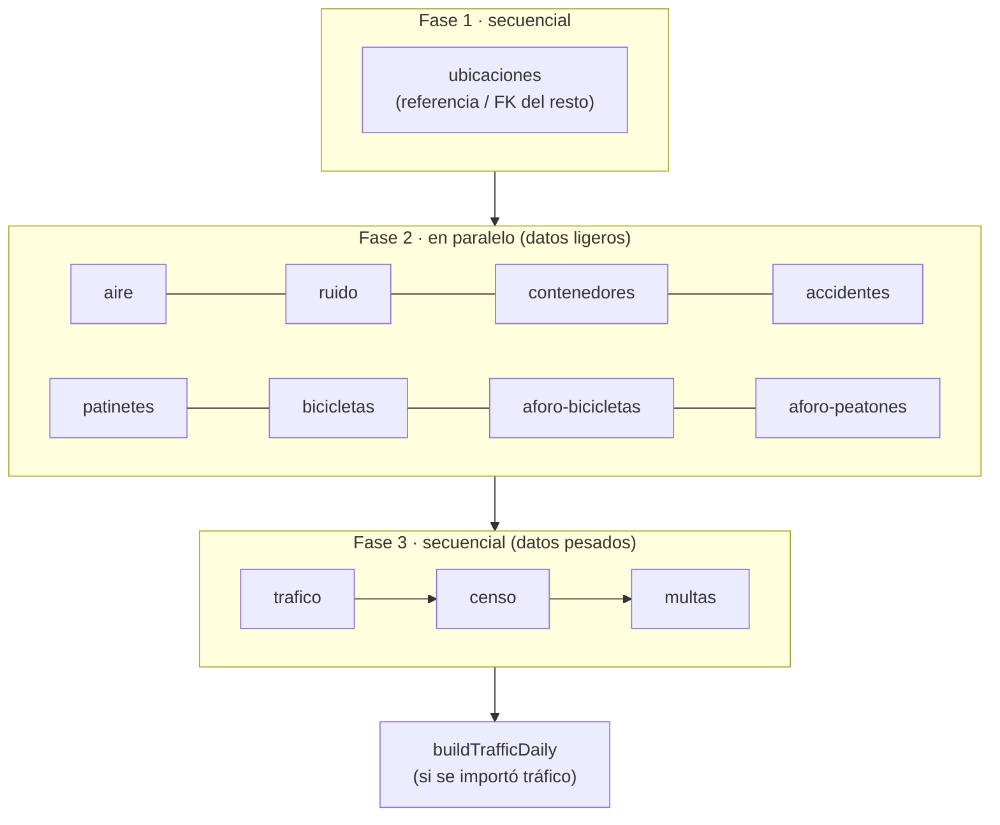

# Scripts de importación y tareas · API-Anthem

Guía detallada de los scripts que pueblan y mantienen la base de datos `Anthem`. Para la visión
general del proyecto, consulta el [README principal](../README.md).

> **Antes de empezar**: descarga el dataset y descomprímelo en `API-Anthem/datos_hpe/` (ver
> [README principal → El dataset original](../README.md#el-dataset-original)). Los importadores
> buscan los CSV/GPX exactamente en esa ruta.

## Tabla de contenidos

- [`importAll.js` — script maestro](#importalljs--script-maestro)
  - [Fases de importación](#fases-de-importación)
  - [Flags](#flags)
  - [Importadores disponibles (`--only`)](#importadores-disponibles---only)
  - [Modo `--atlas` (subset 512 MB)](#modo---atlas-subset-512-mb)
- [`buildTrafficDaily.js` — rollup diario de tráfico](#buildtrafficdailyjs--rollup-diario-de-tráfico)
- [Otros scripts](#otros-scripts)
- [Recetas](#recetas)

---

## `importAll.js` — script maestro

Orquesta los 12 importadores de dominio. Se invoca con npm o directamente:

```bash
npm run import:data                  # equivale a: node scripts/importAll.js
node scripts/importAll.js --help     # ayuda completa
```

Genera resúmenes JSON por importador y por ejecución en `logs/import/` (p. ej.
`<importador>-latest.json` y `run-latest.summary.json`).

### Fases de importación

La importación se ejecuta en **3 fases** para respetar dependencias y no saturar la base de datos:



- **Fase 1 (`ubicaciones`)**: datos de referencia que el resto necesita. Si falla, el proceso
  **aborta** (evita datos huérfanos).
- **Fase 2 (ligeros, < ~300 K docs c/u)**: se ejecutan **en paralelo**.
- **Fase 3 (`trafico`, `censo`, `multas`)**: **secuenciales** (cada uno usa toda la base de datos).
  Cada uno **dropea sus índices secundarios** antes del *insert* y los **recrea** al final, para
  acelerar la carga masiva.
- Si se importa tráfico con éxito, al terminar se reconstruye automáticamente `traffic_daily`.

**Tiempos / timeouts orientativos**: tráfico hasta **6 h** (12 CSV de ~11M filas, *upsert* sobre
100M+ docs); resto de Fase 3 hasta 120 min; Fases 1–2 hasta 30 min. Una importación **completa**
suele tardar **3–4 horas** (más en hardware modesto).

### Flags

| Flag | Efecto |
| --- | --- |
| `--force` | Sobrescribe datos existentes (modo *upsert*). Sin él, una BD vacía usa `insertMany` puro (más rápido). |
| `--only=x,y,z` | Ejecuta solo los importadores indicados (claves de la tabla de abajo). |
| `--atlas` | Subset reducido para Atlas M0 (512 MB), ver más abajo. |
| `--skip-indices-management` | No dropea/recrea índices en la Fase 3 (comportamiento legacy). |
| `--rebuild-indices=trafico[,censo,multas]` | *Recovery*: **solo** recrea índices, sin importar. |
| `--help` | Muestra la ayuda. |

```bash
node scripts/importAll.js --only=ubicaciones,aire,ruido   # solo 3 dominios
node scripts/importAll.js --force                         # forzar sobrescritura
```

### Importadores disponibles (`--only`)

| Clave | Fase | Descripción |
| --- | :---: | --- |
| `ubicaciones` | 1 | Estaciones acústicas, puntos de tráfico y rutas de transporte. |
| `aire` | 2 | Mediciones horarias de contaminantes (12 meses). |
| `ruido` | 2 | Niveles de ruido por estación y periodo del día. |
| `contenedores` | 2 | Ubicación y tipo de contenedores de reciclaje. |
| `accidentes` | 2 | Accidentalidad vial. |
| `patinetes` | 2 | Asignación de patinetes eléctricos. |
| `bicicletas` | 2 | Disponibilidad de bicicletas públicas. |
| `aforo-bicicletas` | 2 | Conteo horario de bicicletas por punto. |
| `aforo-peatones` | 2 | Conteo horario de peatones por punto. |
| `trafico` | 3 | Intensidad y carga de tráfico por punto de medición. |
| `censo` | 3 | Datos censales por sección. |
| `multas` | 3 | Multas de tráfico. |

### Modo `--atlas` (subset 512 MB)

`--atlas` importa un **subconjunto estratificado** calibrado para caber en el límite **lógico**
(`dataSize + indexSize`, sin compresión) del free tier **M0** de Atlas: ~455 MB sobre los 512 MB.
Mantiene la variedad necesaria para que el dashboard luzca (todos los distritos, varios meses,
pirámides con forma, patrones horarios). El plan es la **única fuente** de los números y se edita
en [`importation/helpers/atlasPlan.js`](importation/helpers/atlasPlan.js).

| Colección | Estrategia en `--atlas` |
| --- | --- |
| `ubicaciones` | Entera (referencia del resto). |
| `ruido`, `bicicletas`, `patinetes` | Enteras (series pequeñas). |
| `accidentes` | Entera (~32 K; muestrear partiría expedientes). |
| `contenedores` | Entera (~38 K; lo agradece el mapa por viewport). |
| `aire` | Entera (~55 K; barata y maximiza variedad estacional). |
| `aforo-bicicletas` | Tope 52 K, estratificado por `identificador\|mes\|hora`. |
| `aforo-peatones` | Tope 45 K, estratificado por `identificador\|mes\|hora`. |
| `censo` | Tope 145 K, 4 meses (01/04/07/10), estrato `mes\|distrito\|edad`. |
| `multas` | Tope 300 K, 4 meses (01/04/07/10), estrato `mes\|calificacion\|tipoInfraccion`. |
| `trafico` | Tope 150 K, 4 meses, hasta 15 puntos por tipo (URB/M30) y 10 días contiguos. |

Al terminar, `--atlas` reconstruye `traffic_daily`.

---

## `buildTrafficDaily.js` — rollup diario de tráfico

Los endpoints de tráfico **no leen** los ~132M registros crudos de `traffic_measurements`, sino el
rollup diario pre-agregado **`traffic_daily`** (~1,45M docs), agrupado por `(puntoMedidaId, día)`
con desglose por periodo del día.

```bash
node scripts/buildTrafficDaily.js
```

- **Idempotente**: usa `$out`, reemplazando la colección de forma atómica.
- Crea los índices `idx_daily_fecha`, `idx_daily_tipo_fecha`, `idx_daily_punto_fecha` y
  `idx_daily_punto_dia_unico` (único, para *upsert* incremental desde la ingesta IoT).
- **Cuándo ejecutarlo**: automáticamente tras `import:data` / `--atlas` si el tráfico se importó;
  manualmente **tras cualquier reimportación de tráfico**. Si no, los endpoints de tráfico
  devolverán datos obsoletos o vacíos.

---

## Otros scripts

| Script | Uso |
| --- | --- |
| `provisionarSensor.js` | Crea una cuenta con rol `sensor` para la ingesta IoT. `node scripts/provisionarSensor.js --username=<u> --email=<e> --password=<p>` (o `SENSOR_PASSWORD` por env). |
| `verify_endpoints.js` | *Smoke test* de los endpoints principales contra una instancia en marcha. `BASE_URL=http://localhost:3000/api/v1 node scripts/verify_endpoints.js`. |
| `drop_redundant_indexes.js` | Elimina índices *single-field* redundantes (cubiertos por compuestos). Soporta `--dry-run` y `--only=<coleccion>`. |

---

## Recetas

**Importar todo en local (modo completo):**

```bash
npm run import:data
```

**Subset rápido para Atlas / demo:**

```bash
node scripts/importAll.js --atlas
```

**Reimportar solo el tráfico y rehacer el rollup:**

```bash
node scripts/importAll.js --only=trafico --force
node scripts/buildTrafficDaily.js        # (import:data ya lo hace; aquí lo forzamos)
```

**Recuperar tras un crash entre el *drop* y el *insert* de índices** (la BD quedó sin índices
secundarios en alguna colección pesada):

```bash
node scripts/importAll.js --rebuild-indices=trafico,censo,multas
```

**Aprovisionar un sensor y dejar lista la ingesta IoT:**

```bash
node scripts/provisionarSensor.js --username=nodo_sensor --email=nodo@anthem.local --password=<clave>
# luego: usar esa cuenta en ../simulador-iot
```
